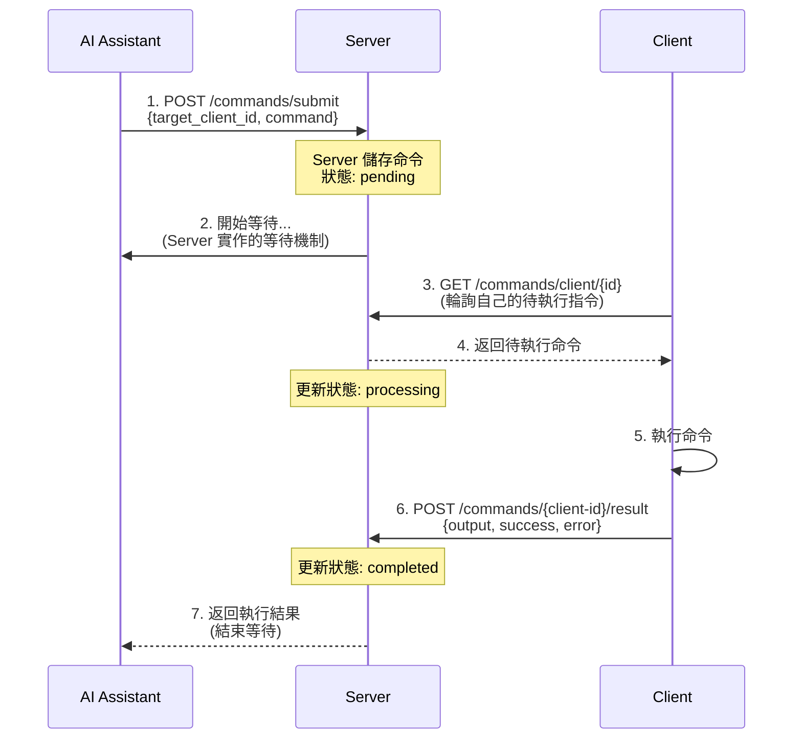

# 異步執行架構設計

## 核心架構理解

### 執行流程


## 關鍵設計原則

### 1. AI 等待機制 (Server Side)
```python
@router.post("/commands/submit")
async def submit_command(request: SubmitCommandRequest):
    """AI 提交命令並等待結果"""
    
    # 創建命令
    command = Command(
        command_id=str(uuid.uuid4()),
        target_client_id=request.target_client_id,
        content=request.command_content,
        status="pending"
    )
    
    # 儲存到 repository
    await command_repository.save(command)
    
    # Server 端實作等待機制
    # 因為不知道 client 何時回傳，需要輪詢或事件等待
    max_wait_time = 30  # 秒
    poll_interval = 0.5
    elapsed_time = 0
    
    while elapsed_time < max_wait_time:
        # 檢查命令狀態
        updated_command = await command_repository.get(command.command_id)
        
        if updated_command.status == "completed":
            # Client 已回傳結果
            return {
                "command_id": command.command_id,
                "submission_successful": True,
                "result": updated_command.result,
                "error": updated_command.error,
                "execution_time": updated_command.execution_time
            }
        elif updated_command.status == "failed":
            # 執行失敗
            return {
                "command_id": command.command_id,
                "submission_successful": False,
                "error": updated_command.error
            }
        
        # 繼續等待
        await asyncio.sleep(poll_interval)
        elapsed_time += poll_interval
    
    # 超時
    return {
        "command_id": command.command_id,
        "submission_successful": False,
        "error": "Command execution timeout"
    }
```

### 2. Client 輪詢機制
```python
@router.get("/commands/client/{client_id}")
async def get_commands_for_client(client_id: str):
    """Client 用自己的 ID 查詢待執行指令"""
    
    # 取得該 client 的待執行指令
    # 重要：同一時間只能有一個指令
    commands = await command_repository.get_pending_commands(client_id)
    
    if commands:
        # 只返回第一個指令（確保單一執行）
        command = commands[0]
        
        # 更新狀態為 processing
        command.status = "processing"
        command.started_at = datetime.now()
        await command_repository.save(command)
        
        return [command.to_dict()]  # 保持向後相容
    
    return []
```

### 3. 結果回傳機制
```python
@router.post("/commands/{client_id}/result")
async def submit_command_result(
    client_id: str,
    request: CommandResultRequest
):
    """Client 回傳執行結果"""
    
    # 找到對應的 processing 命令
    command = await command_repository.get_processing_command(client_id)
    
    if not command:
        raise HTTPException(404, "No processing command found")
    
    # 更新命令結果
    command.status = "completed" if request.success else "failed"
    command.completed_at = datetime.now()
    command.result = request.output
    command.error = request.error
    command.execution_time = request.execution_time
    
    await command_repository.save(command)
    
    # 此時 Server 端的等待迴圈會偵測到狀態變化
    # 並將結果返回給等待中的 AI
    
    return {"status": "success", "message": "Result recorded"}
```

## 單一指令執行保證

### Repository 實作
```python
class FileBasedCommandRepository(CommandRepository):
    
    async def get_pending_commands(self, client_id: str) -> List[Command]:
        """獲取待執行指令，確保單一執行"""
        async with self._lock:
            commands = self._load_commands()
            
            # 檢查是否已有 processing 中的命令
            processing = [
                cmd for cmd in commands.values()
                if cmd.target_client_id == client_id 
                and cmd.status == "processing"
            ]
            
            if processing:
                # 已有執行中的命令，不返回新的
                return []
            
            # 返回第一個 pending 命令
            pending = [
                cmd for cmd in commands.values()
                if cmd.target_client_id == client_id 
                and cmd.status == "pending"
            ]
            
            return pending[:1]  # 最多返回一個
    
    async def get_processing_command(self, client_id: str) -> Optional[Command]:
        """獲取執行中的命令"""
        async with self._lock:
            commands = self._load_commands()
            
            for cmd in commands.values():
                if (cmd.target_client_id == client_id 
                    and cmd.status == "processing"):
                    return cmd
            
            return None
```

## Client 端實作調整

### Bash Client 修改
```bash
#!/bin/bash
# Enhanced client with result submission

# 輪詢並執行
poll_and_execute() {
    # 使用 client_id 查詢
    response=$(curl -s "$SERVER_URL/commands/client/$CLIENT_ID")
    
    if [ "$response" != "[]" ]; then
        # 解析命令
        command_id=$(echo "$response" | jq -r '.[0].command_id')
        command_content=$(echo "$response" | jq -r '.[0].content')
        
        log "INFO" "Executing command: $command_id"
        
        # 執行命令
        start_time=$(date +%s.%N)
        if output=$(eval "$command_content" 2>&1); then
            success="true"
            error="null"
        else
            success="false"
            error="$output"
            output=""
        fi
        end_time=$(date +%s.%N)
        execution_time=$(echo "$end_time - $start_time" | bc)
        
        # 回傳結果
        submit_result "$command_id" "$success" "$output" "$error" "$execution_time"
    fi
}

# 提交結果
submit_result() {
    local command_id="$1"
    local success="$2"
    local output="$3"
    local error="$4"
    local execution_time="$5"
    
    # POST 到 /commands/{client-id}/result
    curl -X POST "$SERVER_URL/commands/$CLIENT_ID/result" \
        -H "Content-Type: application/json" \
        -d "{
            \"command_id\": \"$command_id\",
            \"success\": $success,
            \"output\": \"$(echo "$output" | sed 's/"/\\"/g')\",
            \"error\": \"$(echo "$error" | sed 's/"/\\"/g')\",
            \"execution_time\": $execution_time
        }"
    
    log "INFO" "Result submitted for command: $command_id"
}

# 主迴圈
while true; do
    poll_and_execute
    sleep 3
done
```

## 事件驅動優化（可選）

### 使用 asyncio.Event 優化等待
```python
from asyncio import Event
from typing import Dict

# 命令完成事件管理
command_events: Dict[str, Event] = {}

@router.post("/commands/submit")
async def submit_command(request: SubmitCommandRequest):
    """使用事件驅動的等待機制"""
    
    command = create_command(request)
    await command_repository.save(command)
    
    # 創建等待事件
    event = Event()
    command_events[command.command_id] = event
    
    try:
        # 等待事件或超時
        await asyncio.wait_for(event.wait(), timeout=30)
        
        # 事件觸發，獲取結果
        updated_command = await command_repository.get(command.command_id)
        return format_response(updated_command)
        
    except asyncio.TimeoutError:
        return timeout_response(command.command_id)
    finally:
        # 清理事件
        command_events.pop(command.command_id, None)

@router.post("/commands/{client_id}/result")
async def submit_command_result(client_id: str, request: CommandResultRequest):
    """觸發等待事件"""
    
    # 更新命令結果
    command = await update_command_result(client_id, request)
    
    # 觸發等待事件
    if command.command_id in command_events:
        command_events[command.command_id].set()
    
    return {"status": "success"}
```

## 錯誤處理策略

### 各種異常情況處理
1. **Client 離線**: 設置合理的超時時間
2. **執行失敗**: 記錄錯誤並返回給 AI
3. **網路中斷**: Client 重連後可繼續執行
4. **重複提交**: 檢查是否已有執行中的命令

### 超時處理
```python
# 在 Command entity 中加入超時設定
@dataclass
class Command:
    command_id: str
    target_client_id: str
    content: str
    timeout: int = 30  # 預設 30 秒
    created_at: datetime
    
    def is_timeout(self) -> bool:
        """檢查是否超時"""
        if self.status in ["completed", "failed"]:
            return False
        
        elapsed = (datetime.now() - self.created_at).total_seconds()
        return elapsed > self.timeout
```

## 測試場景

### 1. 正常流程測試
```bash
# Terminal 1: 啟動 server
python -m uvicorn brief_bridge.main:app

# Terminal 2: 啟動 client
./simple-client.sh --client-id test-client

# Terminal 3: AI 提交命令
curl -X POST http://localhost:8000/commands/submit \
    -H "Content-Type: application/json" \
    -d '{
        "target_client_id": "test-client",
        "command_content": "date",
        "command_type": "shell"
    }'

# 預期：AI 會等待並收到執行結果
```

### 2. 超時測試
```bash
# 提交命令但 client 離線
# 預期：30 秒後返回超時錯誤
```

### 3. 單一執行測試
```bash
# 快速提交多個命令
# 預期：Client 一次只執行一個
```

這個架構確保：
1. ✅ AI 提交後會等待結果（Server 端實作）
2. ✅ Client 透過自己的 ID 輪詢指令
3. ✅ 同一時間只有一個指令執行
4. ✅ 結果透過專門的 endpoint 回傳
5. ✅ Server 收到結果後立即返回給等待中的 AI