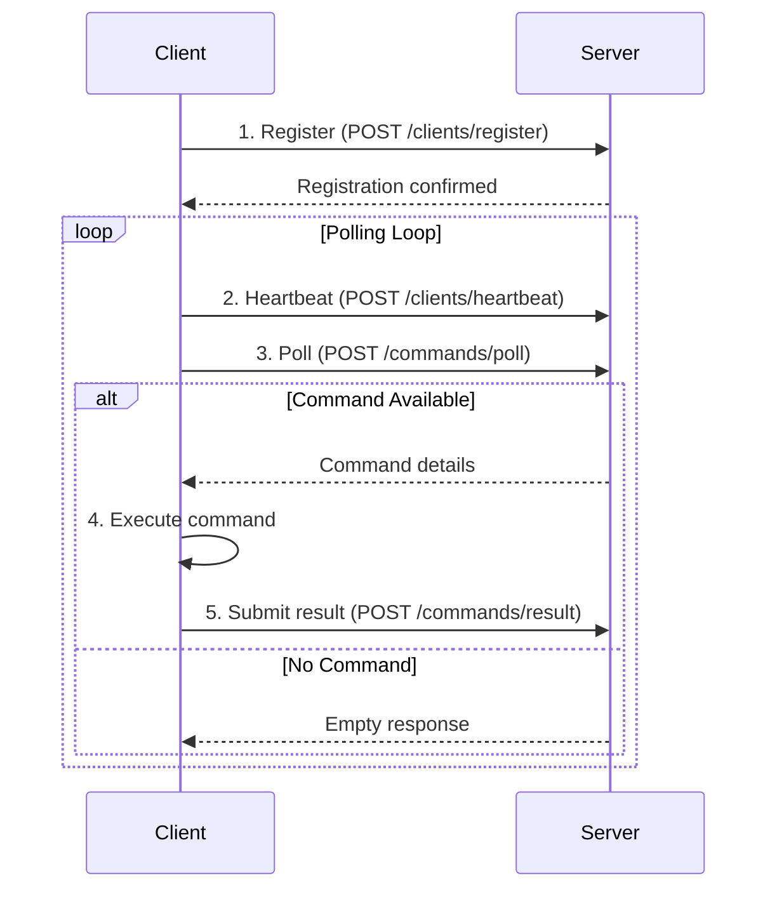

# Cross-Platform Client Strategy

基於 ws-call PowerShell prototype 研究，本文件定義跨平台客戶端的整合策略。

## 平台支援矩陣

| Platform | Client Type | Status | Implementation Priority |
|----------|-------------|---------|-------------------------|
| Linux | Bash HTTP Client | ✅ Implemented | P0 (完成) |
| macOS | Bash HTTP Client | ✅ Implemented | P0 (完成) |
| Windows | PowerShell HTTP Client | 🔄 Planning | P1 (下一階段) |
| Windows | WSL Bash Client | 🔄 Future | P2 (可選) |
| Docker | Container Client | 🔄 Future | P3 (進階) |

## 客戶端架構標準化

### 統一接口規範
所有平台客戶端都應實現相同的核心功能：

```
1. 註冊 (Registration)
2. 心跳 (Heartbeat) 
3. 輪詢 (Polling)
4. 執行 (Execution)
5. 結果提交 (Result Submission)
6. 錯誤處理 (Error Handling)
```

### 標準化流程


## PowerShell Client Implementation

### 基於 ws-call 的 PowerShell 客戶端
```powershell
# Brief Bridge PowerShell Client v2.0
param(
    [string]$ServerUrl = "http://localhost:8000",
    [string]$ClientId = $env:COMPUTERNAME,
    [int]$PollInterval = 3,
    [switch]$Debug
)

$ApiBase = "$ServerUrl"

# 配置
$Config = @{
    ServerUrl = $ServerUrl
    ClientId = $ClientId
    PollInterval = $PollInterval
    MaxRetries = 5
    RetryDelay = 5
    TimeoutSeconds = 30
}

# 1. 註冊客戶端
function Register-Client {
    $body = @{
        client_id = $Config.ClientId
        name = "$($Config.ClientId) - PowerShell Client"
        capabilities = @("shell", "powershell")
        system_info = @{
            os = "windows"
            version = [System.Environment]::OSVersion.VersionString
            arch = [System.Environment]::Is64BitProcess ? "x64" : "x86"
            powershell_version = $PSVersionTable.PSVersion.ToString()
        }
    } | ConvertTo-Json -Depth 10
    
    $response = Invoke-RestMethod -Uri "$ApiBase/clients/register" -Method POST -Body $body -ContentType "application/json"
    Write-Host "[REGISTER] Client registered: $($Config.ClientId)" -ForegroundColor Green
}

# 2. 發送心跳
function Send-Heartbeat {
    $body = @{
        client_id = $Config.ClientId
        status = "online"
    } | ConvertTo-Json
    
    try {
        Invoke-RestMethod -Uri "$ApiBase/clients/heartbeat" -Method POST -Body $body -ContentType "application/json" | Out-Null
        if ($Config.Debug) { Write-Host "[HEARTBEAT] Sent for $($Config.ClientId)" -ForegroundColor Cyan }
    }
    catch {
        Write-Warning "[HEARTBEAT] Failed: $($_.Exception.Message)"
    }
}

# 3. 輪詢命令
function Get-PendingCommand {
    $body = @{
        client_id = $Config.ClientId
    } | ConvertTo-Json
    
    try {
        $response = Invoke-RestMethod -Uri "$ApiBase/commands/poll" -Method POST -Body $body -ContentType "application/json"
        
        if ($response.id) {
            Write-Host "[POLL] Received command: $($response.id)" -ForegroundColor Magenta
            return $response
        }
        return $null
    }
    catch {
        Write-Warning "[POLL] Failed: $($_.Exception.Message)"
        return $null
    }
}

# 4. 執行命令
function Invoke-Command {
    param([object]$Command)
    
    $startTime = Get-Date
    Write-Host "[EXEC] $($Command.command)" -ForegroundColor Yellow
    
    try {
        # 根據命令類型執行
        if ($Command.type -eq "powershell") {
            $output = Invoke-Expression $Command.command 2>&1 | Out-String
        } else {
            # 默認為 shell 命令
            $output = cmd.exe /c $Command.command 2>&1 | Out-String
        }
        
        $success = $true
        $error = $null
        Write-Host "[SUCCESS] Command completed" -ForegroundColor Green
    }
    catch {
        $output = $null
        $success = $false
        $error = $_.Exception.Message
        Write-Host "[ERROR] $error" -ForegroundColor Red
    }
    
    $executionTime = ((Get-Date) - $startTime).TotalSeconds
    
    return @{
        success = $success
        output = $output
        error = $error  
        execution_time = $executionTime
    }
}

# 5. 提交結果
function Submit-Result {
    param(
        [string]$CommandId,
        [object]$Result
    )
    
    $body = @{
        command_id = $CommandId
        success = $Result.success
        output = $Result.output
        error = $Result.error
        execution_time = $Result.execution_time
    } | ConvertTo-Json -Depth 10
    
    try {
        Invoke-RestMethod -Uri "$ApiBase/commands/result" -Method POST -Body $body -ContentType "application/json" | Out-Null
        Write-Host "[RESULT] Submitted for command: $CommandId" -ForegroundColor Green
    }
    catch {
        Write-Error "[RESULT] Failed to submit: $($_.Exception.Message)"
    }
}

# 主執行迴圈
function Start-Client {
    Write-Host "=== Brief Bridge PowerShell Client ===" -ForegroundColor Green
    Write-Host "Server: $($Config.ServerUrl)" -ForegroundColor Cyan
    Write-Host "Client ID: $($Config.ClientId)" -ForegroundColor Cyan
    Write-Host "Poll Interval: $($Config.PollInterval)s" -ForegroundColor Cyan
    Write-Host ""
    
    # 註冊客戶端
    Register-Client
    
    # 主輪詢迴圈
    $consecutiveErrors = 0
    try {
        while ($true) {
            try {
                # 發送心跳
                Send-Heartbeat
                
                # 輪詢命令
                $command = Get-PendingCommand
                
                if ($command) {
                    $consecutiveErrors = 0
                    
                    # 執行命令
                    $result = Invoke-Command -Command $command
                    
                    # 提交結果
                    Submit-Result -CommandId $command.id -Result $result
                } else {
                    $consecutiveErrors = 0
                }
            }
            catch {
                $consecutiveErrors++
                Write-Error "Polling error ($consecutiveErrors/$($Config.MaxRetries)): $($_.Exception.Message)"
                
                if ($consecutiveErrors -ge $Config.MaxRetries) {
                    Write-Error "Too many consecutive errors. Exiting."
                    break
                }
                
                Start-Sleep -Seconds $Config.RetryDelay
            }
            
            Start-Sleep -Seconds $Config.PollInterval
        }
    }
    finally {
        Write-Host "Client shutting down..." -ForegroundColor Yellow
    }
}

# 啟動客戶端
Start-Client
```

## Bash Client Enhancement

### 增強現有 Bash 客戶端支援結果提交
```bash
#!/bin/bash
# Enhanced Brief Bridge Bash Client with Result Submission

# 新增：提交結果函數
submit_command_result() {
    local command_id="$1"
    local success="$2"
    local output="$3"
    local error="$4"
    local execution_time="$5"
    
    log "DEBUG" "Submitting result for command: $command_id"
    
    local json_payload=$(cat <<EOF
{
    "command_id": "$command_id",
    "success": $success,
    "output": $(echo "$output" | jq -R -s .),
    "error": $(echo "$error" | jq -R -s .),
    "execution_time": $execution_time
}
EOF
    )
    
    local http_code
    http_code=$(curl -s -o /dev/null -w "%{http_code}" -X POST \
        -H "Content-Type: application/json" \
        -d "$json_payload" \
        "$SERVER_URL/commands/result")
    
    if [ "$http_code" = "200" ]; then
        log "INFO" "Result submitted successfully for command: $command_id"
        return 0
    else
        log "WARN" "Failed to submit result (HTTP $http_code) for command: $command_id"
        return 1
    fi
}

# 增強：執行命令函數 (支援結果提交)
execute_command_with_result() {
    local command_content="$1"
    local command_id="$2"
    
    log "INFO" "Executing command: $command_id"
    log "DEBUG" "Command content: $command_content"
    
    local start_time=$(date +%s.%N)
    local exit_code=0
    local output=""
    local error=""
    
    # 執行命令
    if output=$(eval "$command_content" 2>&1); then
        exit_code=0
        log "INFO" "Command executed successfully"
    else
        exit_code=$?
        error="Command failed with exit code $exit_code"
        log "WARN" "Command failed with exit code $exit_code"
    fi
    
    local end_time=$(date +%s.%N)
    local execution_time=$(echo "$end_time - $start_time" | bc -l 2>/dev/null || echo "0")
    
    # 顯示輸出
    echo "=== Command Output ==="
    echo "$output"
    echo "======================"
    
    # 提交結果
    local success="true"
    if [ $exit_code -ne 0 ]; then
        success="false"
    fi
    
    submit_command_result "$command_id" "$success" "$output" "$error" "$execution_time"
    
    return $exit_code
}

# 更新：輪詢函數使用新的 /commands/poll API
poll_for_commands_v2() {
    log "DEBUG" "Polling for commands using v2 API"
    
    local json_payload="{\"client_id\": \"$CLIENT_ID\"}"
    local response
    local http_code
    
    response=$(curl -s -w "\n%{http_code}" -X POST \
        -H "Content-Type: application/json" \
        -d "$json_payload" \
        "$SERVER_URL/commands/poll")
    
    http_code=$(echo "$response" | tail -n1)
    local body=$(echo "$response" | sed '$d')
    
    if [ "$http_code" = "200" ]; then
        # 檢查是否有命令
        local command_id=$(echo "$body" | jq -r '.id // empty' 2>/dev/null)
        if [ -n "$command_id" ] && [ "$command_id" != "null" ]; then
            local command_content=$(echo "$body" | jq -r '.command' 2>/dev/null)
            log "INFO" "Received command: $command_id"
            
            # 執行命令並提交結果
            execute_command_with_result "$command_content" "$command_id"
            return 0
        fi
    else
        log "WARN" "Poll failed (HTTP $http_code)"
    fi
    
    log "DEBUG" "No commands available"
    return 1
}
```

## 統一配置管理

### 動態配置獲取
```bash
# 獲取客戶端配置
get_client_config() {
    local config_url="$SERVER_URL/config/$CLIENT_ID"
    local config
    
    if config=$(curl -s "$config_url" 2>/dev/null); then
        # 解析配置
        POLL_INTERVAL=$(echo "$config" | jq -r '.poll_interval // 3')
        TIMEOUT=$(echo "$config" | jq -r '.timeout // 30')
        MAX_RETRIES=$(echo "$config" | jq -r '.max_retries // 5')
        
        log "INFO" "Configuration loaded from server"
        log "DEBUG" "Poll interval: ${POLL_INTERVAL}s, Timeout: ${TIMEOUT}s"
    else
        log "WARN" "Failed to load configuration, using defaults"
    fi
}
```

## 一鍵安裝系統

### PowerShell 一鍵安裝
```powershell
# 一行安裝和啟動
iex ((Invoke-WebRequest 'http://server:8000/install.ps1?client_id=my-laptop').Content) -Start
```

### Bash 一鍵安裝  
```bash
# 一行安裝和啟動
curl -fsSL http://server:8000/install.sh?client_id=my-server | bash -s -- --start
```

### 安裝腳本服務端實現
```python
@router.get("/install.ps1")
async def get_powershell_installer(
    request: Request,
    client_id: str = Query(default=None),
    poll_interval: int = Query(default=3)
):
    # 獲取服務器 URL
    server_url = get_server_url(request)
    
    # 生成 PowerShell 客戶端腳本
    script_template = read_template("powershell-client.ps1.template")
    script_content = script_template.format(
        server_url=server_url,
        default_client_id=client_id or "$env:COMPUTERNAME", 
        default_poll_interval=poll_interval
    )
    
    return PlainTextResponse(
        content=script_content,
        headers={"Content-Disposition": "attachment; filename=brief-bridge-client.ps1"}
    )

@router.get("/install.sh") 
async def get_bash_installer(
    request: Request,
    client_id: str = Query(default=None),
    poll_interval: int = Query(default=3)
):
    # 類似實現
    pass
```

## 測試策略

### 跨平台整合測試
```bash
# 測試腳本：test-cross-platform.sh

# 1. 啟動服務器
python -m uvicorn brief_bridge.main:app --port 8000 &
SERVER_PID=$!

# 2. 啟動多平台客戶端
./testkits/clients/simple-client.sh --client-id linux-client --poll-interval 2 &
LINUX_CLIENT_PID=$!

# Windows (在 Windows 機器上執行)
# powershell.exe -Command "iex ((Invoke-WebRequest 'http://server:8000/install.ps1').Content) -Start"

# 3. 提交測試命令
curl -X POST http://localhost:8000/commands/submit \
    -H "Content-Type: application/json" \
    -d '{"target_client_id": "linux-client", "command_content": "uname -a", "command_type": "shell"}'

# 4. 驗證結果
sleep 5
curl -X GET http://localhost:8000/commands/ | jq '.[] | select(.status == "completed")'

# 清理
kill $LINUX_CLIENT_PID $SERVER_PID
```

### 效能測試
```bash
# 並發客戶端測試
for i in {1..10}; do
    ./testkits/clients/simple-client.sh --client-id "client-$i" &
done

# 負載測試
./testkits/clients/fake-ai.sh --target-client client-1 --count 100 --interval 1
```

## 部署建議

### 生產環境配置
```yaml
# docker-compose.yml
version: '3.8'
services:
  brief-bridge:
    image: brief-bridge:latest
    ports:
      - "8000:8000"
    environment:
      - DATA_DIR=/app/data
    volumes:
      - ./data:/app/data
      
  # 可選：ngrok 用於外網存取  
  ngrok:
    image: ngrok/ngrok:latest
    command: http brief-bridge:8000
    environment:
      - NGROK_AUTHTOKEN=${NGROK_TOKEN}
```

### 安全考量
- HTTPS/TLS 加密通訊
- 客戶端認證 (API Key 或 JWT)
- 命令執行權限控制
- 輸出內容過濾 (避免敏感資訊外洩)

這個跨平台策略確保 Brief Bridge 能在各種環境中提供統一、可靠的遠端命令執行服務。