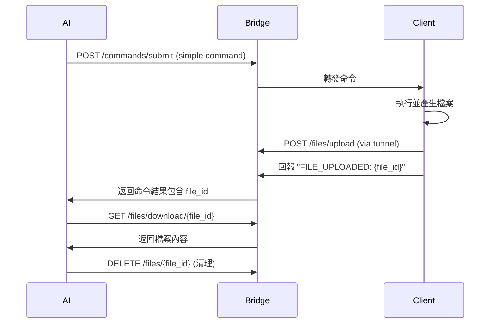
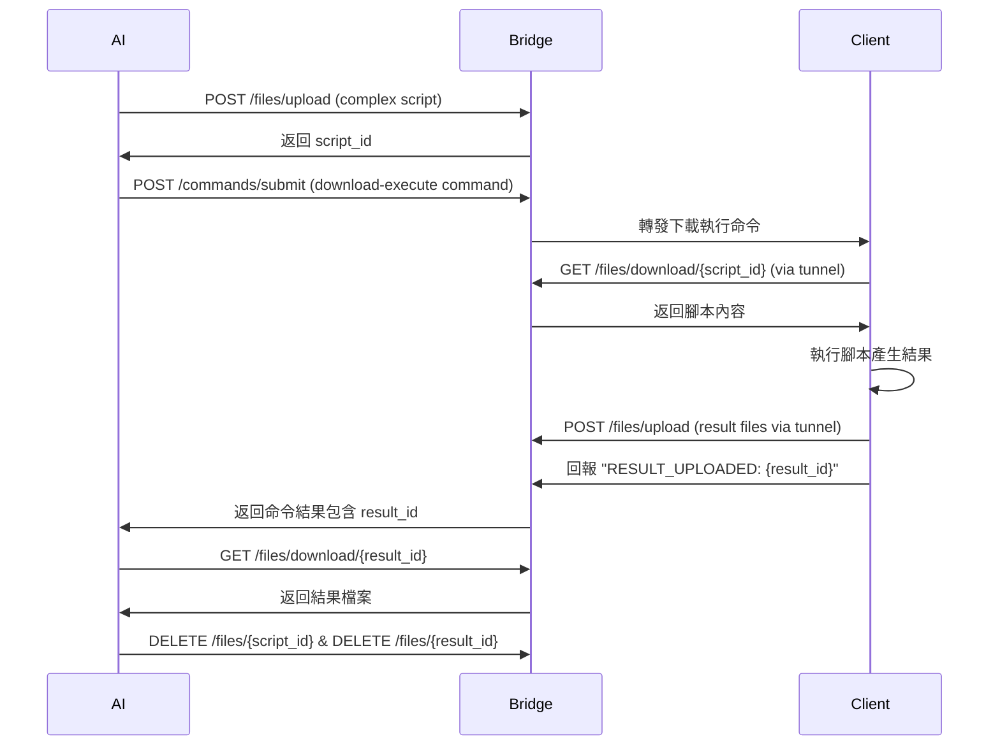

# Brief Bridge 檔案傳輸工作流程

## 🎯 概述

Brief Bridge 提供強大的檔案傳輸功能，支援 AI 與遠程客戶端之間的雙向檔案交換。這份文檔詳細說明三種主要工作流程以及實際應用場景。

## 🏗️ 架構設計

```
[AI 本地] ←→ [Brief Bridge 本地] ←→ [Tunnel] ←→ [客戶端遠程]
localhost        localhost           tunnel URL
```

### URL 使用策略

| 使用者 | 操作類型 | URL 類型 | 範例 |
|--------|----------|----------|------|
| **AI** | 所有操作 | localhost | `http://localhost:2266/files/*` |
| **客戶端** | 上傳/下載 | tunnel URL | `https://abc123.ngrok-free.app/files/*` |

## 📋 三種主要工作流程

### 1. 簡單命令工作流程

**適用場景：** 簡單任務，結果檔案較小
- 截圖
- 系統資訊收集  
- 小型日誌文件

**流程步驟：**



**實際命令範例：**

```bash
# 1. AI 發送截圖命令
curl -X POST http://localhost:2266/commands/submit \
  -H "Content-Type: application/json" \
  -d '{
    "target_client_id": "remote-pc",
    "command_content": "Add-Type -AssemblyName System.Windows.Forms,System.Drawing; $s=[System.Windows.Forms.SystemInformation]::VirtualScreen; $b=New-Object System.Drawing.Bitmap $s.Width,$s.Height; $g=[System.Drawing.Graphics]::FromImage($b); $g.CopyFromScreen(0,0,0,0,$s.Size); $f=\"$env:TEMP\\screenshot.png\"; $b.Save($f,[System.Drawing.Imaging.ImageFormat]::Png); $r=Invoke-RestMethod -Uri \"https://tunnel-url/files/upload\" -Method POST -Form @{file=Get-Item $f; client_id=$env:COMPUTERNAME}; Write-Output \"SCREENSHOT_UPLOADED: $($r.file_id)\"",
    "command_type": "shell"
  }'

# 2. 從返回結果提取 file_id
# Response: {"result": "SCREENSHOT_UPLOADED: abc123-def456", ...}

# 3. 下載檔案
curl http://localhost:2266/files/download/abc123-def456 > screenshot.png

# 4. 清理
curl -X DELETE http://localhost:2266/files/abc123-def456
```

### 2. 複雜腳本工作流程  

**適用場景：** 複雜任務，需要大型腳本
- 系統診斷
- 多步驟操作
- 大型報告生成

**流程步驟：**



**實際操作範例：**

```bash
# 1. AI 上傳複雜診斷腳本
curl -X POST http://localhost:2266/files/upload \
  -F "file=@system_diagnostic.ps1" \
  -F "client_id=ai-assistant"
# Response: {"file_id": "script-abc123", ...}

# 2. AI 發送下載執行命令
curl -X POST http://localhost:2266/commands/submit \
  -H "Content-Type: application/json" \
  -d '{
    "target_client_id": "remote-pc", 
    "command_content": "$script = Invoke-WebRequest \"https://tunnel-url/files/download/script-abc123\" | Select-Object -ExpandProperty Content; $scriptBlock = [ScriptBlock]::Create($script); Invoke-Command -ScriptBlock $scriptBlock",
    "command_type": "shell"
  }'

# 3. 客戶端執行後回報結果 ID
# Response: {"result": "DIAGNOSTIC_COMPLETED: result-xyz789", ...}

# 4. AI 下載結果
curl http://localhost:2266/files/download/result-xyz789 > diagnostic_report.json

# 5. 清理檔案
curl -X DELETE http://localhost:2266/files/script-abc123
curl -X DELETE http://localhost:2266/files/result-xyz789
```

### 3. 批次處理工作流程

**適用場景：** 多台機器重複任務
- 跨機器日誌分析
- 批次截圖
- 統一配置部署

**流程特點：**
- 腳本上傳一次，多次重複使用
- 支援參數化執行
- 集中收集和分析結果

## 🔧 API 端點詳細說明

### 檔案管理 API

#### `POST /files/upload`
上傳檔案到伺服器

**請求格式：**
```bash
curl -X POST http://localhost:2266/files/upload \
  -F "file=@script.ps1" \
  -F "client_id=source-identifier"
```

**回應格式：**
```json
{
  "file_id": "abc123-def456",
  "filename": "script.ps1", 
  "size": 2048,
  "content_type": "text/plain",
  "client_id": "source-identifier",
  "status": "uploaded"
}
```

#### `GET /files/download/{file_id}`
下載檔案

**請求格式：**
```bash
curl http://localhost:2266/files/download/abc123-def456 > local_file.ext
```

#### `GET /files/`
列出所有檔案

**回應格式：**
```json
{
  "files": [
    {
      "file_id": "abc123",
      "filename": "script.ps1",
      "client_id": "ai-assistant",
      "content_type": "text/plain",
      "size": 2048
    }
  ],
  "total_count": 1
}
```

#### `DELETE /files/{file_id}`
刪除檔案

**請求格式：**
```bash
curl -X DELETE http://localhost:2266/files/abc123-def456
```

## 💡 最佳實踐建議

### 1. 檔案命名策略
```powershell
# 使用有意義的檔案名
$timestamp = Get-Date -Format "yyyyMMdd_HHmmss"
$filename = "screenshot_${env:COMPUTERNAME}_${timestamp}.png"
```

### 2. 錯誤處理
```powershell
try {
    # 檔案操作
    $response = Invoke-RestMethod -Uri "$ServerUrl/files/upload" -Method POST -Form @{
        file = Get-Item $tempFile
        client_id = $env:COMPUTERNAME
    }
    Write-Output "SUCCESS_UPLOADED: $($response.file_id)"
} catch {
    Write-Output "UPLOAD_FAILED: $($_.Exception.Message)"
}
```

### 3. 資源清理
```bash
# AI 端定期清理舊檔案
curl http://localhost:2266/files/ | jq -r '.files[] | select(.client_id == "ai-assistant") | .file_id' | xargs -I {} curl -X DELETE http://localhost:2266/files/{}
```

## 🚨 安全考量

### 當前限制
- ✅ 支援本地 AI + 遠程客戶端
- ❌ 遠程 AI 需要認證機制（未實作）
- ❌ 檔案內容加密（未實作）

### 未來安全功能
- JWT 認證機制
- 檔案內容對稱加密
- API 金鑰輪換
- 存取日誌記錄

## 📊 效能優化建議

1. **檔案大小限制：** 建議單檔 < 100MB
2. **並發上傳：** 避免同時大量檔案傳輸
3. **定期清理：** 實作自動檔案清理機制
4. **壓縮傳輸：** 大型檔案建議壓縮後傳輸

## 🐛 常見問題排除

### Q1: 檔案上傳失敗
```bash
# 檢查檔案是否存在且可讀
ls -la target_file
# 檢查網路連通性  
curl -I http://localhost:2266/files/
```

### Q2: 下載檔案損壞
```bash
# 比對檔案大小
curl -I http://localhost:2266/files/download/{file_id}
# 重新下載
curl http://localhost:2266/files/download/{file_id} > file_copy.ext
```

### Q3: Tunnel URL 無法存取
```bash
# 檢查 tunnel 狀態
curl http://localhost:2266/tunnel/status
# 重新設定 tunnel
curl -X POST http://localhost:2266/tunnel/setup -d '{"provider": "ngrok"}'
```